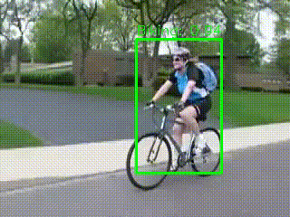

# Spatial-temporal Action Detection YOWOv2 Pytorch Lightning




# Documentation
[Installation](#installation)

[Training](#training)

[Evaluation](#evaluation)

[Dataset](#dataset)

[Inference](#inference)

[Export ONNX](#onnx)

## Weights
UCF24:

|      Model     |  Clip  | GFLOPs |  Params | F-mAP |    Weight    |
|----------------|--------|--------|---------|-------|--------------|
|  YOWOv2-Nano   |   16   |  1.3   | 3.5 M   | 78.8  | [ckpt](https://github.com/lamnguyenvux/YOWOv2-PL/releases/download/v0.1.0/yowo_v2_nano_ucf24_16.ckpt) |
|  YOWOv2-Tiny   |   16   |  2.9   | 10.9 M  | 80.5  | [ckpt](https://github.com/lamnguyenvux/YOWOv2-PL/releases/download/v0.1.0/yowo_v2_tiny_ucf24_16.ckpt) |
|  YOWOv2-Medium |   16   |  12.0  | 52.0 M  | 83.1  | [ckpt](https://github.com/lamnguyenvux/YOWOv2-PL/releases/download/v0.1.0/yowo_v2_medium_ucf24_16.ckpt) |
|  YOWOv2-Large  |   16   |  53.6 | 109.7 M | 85.2  | [ckpt](https://github.com/lamnguyenvux/YOWOv2-PL/releases/download/v0.1.0/yowo_v2_large_ucf24_16.ckpt) |

AVA:
|     Model      |    Clip    |    mAP    |   FPS   |    weight    |
|----------------|------------|-----------|---------|--------------|
|  YOWOv2-Nano   |     16     |   12.6    |   40    | [ckpt](https://github.com/lamnguyenvux/YOWOv2-PL/releases/download/v0.1.0/yowo_v2_nano_ava2_16.ckpt) |
|  YOWOv2-Tiny   |     16     |   14.9    |   49    | [ckpt](https://github.com/lamnguyenvux/YOWOv2-PL/releases/download/v0.1.0/yowo_v2_tiny_ava2_16.ckpt) |
|  YOWOv2-Medium |     16     |   18.4    |   41    | [ckpt](https://github.com/lamnguyenvux/YOWOv2-PL/releases/download/v0.1.0/yowo_v2_medium_ava2_16.ckpt) |
|  YOWOv2-Large  |     16     |   20.2    |   29    | [ckpt](https://github.com/lamnguyenvux/YOWOv2-PL/releases/download/v0.1.0/yowo_v2_large_ava2_16.ckpt) |

## Installation
require python 3.10 or higher
```
python -m venv venv

source venv/bin/activate

pip install .
```

## Training
Change path to your dataset and other parameters in config file from folder `configs`

```
yowo fit -c configs/ucf24/yowov2_nano_ucf24_jhmdb21.yaml
```

You can also overwrite paramters in the config file via command in terminal:
```
yowo fit -c configs/ucf24/yowov2_tiny_ucf24_jhmdb21.yaml \
    --seed_everything=42 \
    --data.data_dir="/kaggle/input/ucf24-spatial-temporal-localization-yowo/ucf24" \
    --data.batch_size.train=64 \
    --data.batch_size.val=32 \
    --data.num_workers="auto" \
    --model.warmup_config.scheduler.max_iter=250 \
    --model.warmup_config.interval="step" \
    --model.freeze_backbone_2d="false" \
    --model.freeze_backbone_3d="false" \
    --model.model_config.head_act="silu" \
    --trainer.max_epochs=7 \
    --trainer.accumulate_grad_batches=2 \
    --trainer.accelerator="gpu" \
    --trainer.devices=1 \
    --trainer.precision="16-mixed" \
    --trainer.strategy="auto" \
    --trainer.callbacks+="lightning.pytorch.callbacks.ModelCheckpoint" \
    --trainer.callbacks.monitor="map" \
    --trainer.callbacks.filename="{epoch}-{map:.3f}" \
    --trainer.callbacks.mode="max" \
    --trainer.callbacks.save_last="true" \
    --trainer.callbacks.save_top_k=3 \
    --trainer.callbacks.dirpath="/kaggle/working/logs/weights" \
    --ckpt_path="/kaggle/working/logs/weights/last.ckpt" # this one to resume the training from last checkpoint
```
By default, Pytorch Lightning uses logger Tensorboard. You can use other loggers as well. Find out more which logger is supported [Loggers](https://lightning.ai/docs/pytorch/stable/extensions/logging.html)
An example of using WanDB logger
```
yowo fit -c configs/ucf24/yowov2_tiny_ucf24_jhmdb21.yaml \
    --trainer.logger.class_path="lightning.pytorch.loggers.WandbLogger" \
    --trainer.logger.name="experiment-yowo-tiny_2024-07-22_00:35" \
    --trainer.logger.project="spatial-temporal-action-detection-yowov2" \
    --trainer.logger.tags="['P100', 'ucf24', 'tiny', 'freeze-backbone', 'blurpool']" \
    --trainer.logger.log_model="all" \
    --trainer.logger.save_dir="/kaggle/working/logs" \
    --trainer.logger.id="i2yvhgrp" \
```
- `trainer.logger.class_path` is the path where you can import logger module: `lightning.pytorch.loggers.WandbLogger`, `lightning.pytorch.loggers.CSVLogger`
- other `trainer.logger.*` are arguments provided for that module class. As we can see, `WandbLogger` needs some arguments such as `name`, `project`, `log_model`, `save_dir`, etc...

## Evaluation
Validate
```
yowo validate -c configs/ucf24/yowov2_tiny_ucf24_jhmdb21.yaml \
    --seed_everything=42 \
    --data.data_dir="/kaggle/input/ucf24-spatial-temporal-localization-yowo/ucf24" \
    --data.batch_size.val=64 \
    --data.num_workers="auto" \
    --model.freeze_backbone_2d="false" \
    --model.freeze_backbone_3d="false" \
    --model.model_config.head_act="silu" \
    --trainer.accelerator="gpu" \
    --trainer.devices=1 \
    --trainer.precision="16-mixed" \
    --ckpt_path="/kaggle/working/logs/weights/last.ckpt" \
```
or Test
```
yowo test -c configs/ucf24/yowov2_tiny_ucf24_jhmdb21.yaml
```
*Note* `ckpt_path` has to be specified while testing and validating

## Dataset
1. UCF24
Download: [UCF24 Dataset](https://www.kaggle.com/datasets/vulamnguyen/ucf24-spatial-temporal-localization-yowo)

Structure of UCF24 dataset inside root directory
```
├── rgb-images
│   ├── BasketBall #action class
│   |    └── v_Basketball_g01_c01 # video split for that action
│   |        ├── 00001.jpg
│   |        ├── 00002.jpg
│   |        ├── ...
│   |        └── 00030.jpg
│   └── Biking
│        ├── v_Biking_g01_c01
│        |   ├── 00001.jpg
│        |   ├── 00002.jpg
│        |   ├── ...
│        |   └── 00040.jpg
│        └── v_Biking_g01_c02
│            ├── 00001.jpg
│            ├── 00002.jpg
│            ├── ...
│            └── 00045.jpg
│
├── labels # annotation files
│   ├── BasketBall #action class
│   |    └── v_Basketball_g01_c01 # video split for that action
│   |        ├── 00001.txt
│   |        ├── 00002.txt
│   |        ├── ...
│   |        └── 00030.txt
│   └── Biking
│        ├── v_Biking_g01_c01
│        |   ├── 00001.txt
│        |   ├── 00002.txt
│        |   ├── ...
│        |   └── 00040.txt
│        └── v_Biking_g01_c02
│            ├── 00001.txt
│            ├── 00002.txt
│            ├── ...
│            └── 00045.txt
```
`trainlist.txt`: contains path to training data like this:
```
labels/Basketball/v_Basketball_g08_c01/00070.txt
labels/Basketball/v_Basketball_g08_c01/00071.txt
labels/Basketball/v_Basketball_g08_c01/00072.txt
labels/Basketball/v_Basketball_g08_c01/00073.txt
```
`testlist.txt` is the same as `trainlist.txt`

2. AVA
```
git clone --recurse-submodules https://github.com/lamnguyenvux/YOWOv2-PL.git
```
Donwload AVA dataset following steps in `download/AVA_Dataset`

Structure of AVA dataset:
```
AVA_Dataset (data_root)
|_ videos
|  |_ [trainval]
|  |  |_ [video name 0]
|  |  |_ [video name 1]
|  |  |_ ...
|  |_ [test]
|     |_ [video name 0]
|     |_ [video name 1]
|     |_ ...
|_ videos_15min
|  |_ [video name 0]
|  |_ [video name 1]
|  |_ ...
|_ frames (frame_dir)
|  |_ [video name 0]
|  |  |_ [video name 0]_000001.jpg
|  |  |_ [video name 0]_000002.jpg
|  |  |_ ...
|  |_ [video name 1]
|     |_ [video name 1]_000001.jpg
|     |_ [video name 1]_000002.jpg
|     |_ ...
|_ frame_lists (frame_list)
|  |_ train.csv
|  |_ val.csv
|_ annotations (annotation_dir)
   |_ ava_train_predicted_boxes.csv
   |_ ava_val_predicted_boxes.csv
   |_ ava_v2.2
        |_ ava_action_list_v2.2_for_activitynet_2019 (labelmap_file)
        |_ ava_train_v2.2.csv (gt_box_list)
        |_ ava_train_excluded_timestamps_v2.2.csv (exclusion_file)
```

## Inference
```
python scripts/inference.py \
    --source <video path or camera id> \
    --checkpoint <checkpoint path> \
    --conf <confidence (float)> \
    --multihot # use multihot for multiple classes (AVA) \
    --classname <path to classname txt> \
    --len-clip <length input (default: 16)> \
    --cuda # use cuda 
```

## ONNX
Export ONNX:
```
python scripts/export_onnx.py \
    --ckpt <checkpoint/path> \
    --len-clip <length input (default: 16)> \
    --onnx <path/to/write/onnx>

```

Inference onnx:
```
python scripts/inference_onnx.py \
    --source 0 \
    --checkpoint <path/to/onnx> \
    --multiclass \ # multiclass (AVA)
    --classname classnames/ava2.txt
```

## References

```
@article{yang2023yowov2,
  title={YOWOv2: A Stronger yet Efficient Multi-level Detection Framework for Real-time Spatio-temporal Action Detection},
  author={Yang, Jianhua and Kun, Dai},
  journal={arXiv preprint arXiv:2302.06848},
  year={2023}
}
```